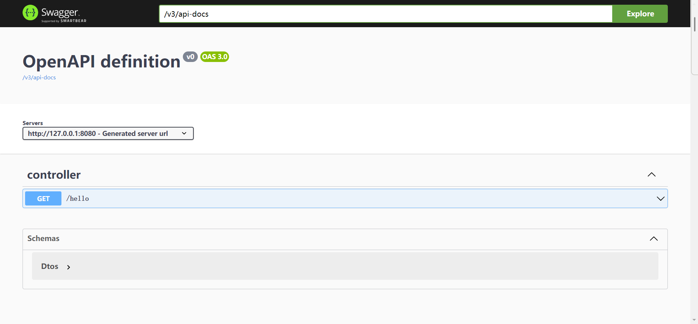

---
categories:
  - tools
tags:
  - 接口文档
title: OpenAPI的使用教程
date: 2023-11-26 23:42:32
updated: 2023-11-26 23:49:20
---

# 前言 

这个东西是因为我要去实习了,然后要会使用swagger, 而因为我尝试使用swagger的项目springboot和java版本过高, 所以遂尝试使用下OpenAPI来做开发文档了

# 简单启动

我的pom文件

```pom
<?xml version="1.0" encoding="UTF-8"?>
<project xmlns="http://maven.apache.org/POM/4.0.0"
         xmlns:xsi="http://www.w3.org/2001/XMLSchema-instance"
         xsi:schemaLocation="http://maven.apache.org/POM/4.0.0 http://maven.apache.org/xsd/maven-4.0.0.xsd">
    <modelVersion>4.0.0</modelVersion>

    <groupId>com.russel</groupId>
    <artifactId>example</artifactId>
    <version>1.0-SNAPSHOT</version>

    <properties>
        <maven.compiler.source>21</maven.compiler.source>
        <maven.compiler.target>21</maven.compiler.target>
        <project.build.sourceEncoding>UTF-8</project.build.sourceEncoding>
    </properties>
    <dependencies>
        <dependency>
            <groupId>junit</groupId>
            <artifactId>junit</artifactId>
            <version>4.13.1</version>
            <scope>compile</scope>
        </dependency>
        <dependency>
            <groupId>com.fasterxml.jackson.core</groupId>
            <artifactId>jackson-databind</artifactId>
            <version>2.13.3</version> <!-- Use the latest version -->
        </dependency>
        <dependency>
            <groupId>com.alibaba</groupId>
            <artifactId>fastjson</artifactId>
            <version>1.2.83_noneautotype</version>
        </dependency>
        <dependency>
            <groupId>org.springframework.boot</groupId>
            <artifactId>spring-boot-test</artifactId>
            <version>3.1.2</version>
        </dependency>
        <dependency>
            <groupId>org.springframework.boot</groupId>
            <artifactId>spring-boot-starter-web</artifactId>
            <version>3.1.2</version>
        </dependency>
        <dependency>
            <groupId>org.springdoc</groupId>
            <artifactId>springdoc-openapi-starter-webmvc-ui</artifactId>
            <version>2.2.0</version>
        </dependency>
    </dependencies>

</project>
```

然后启动, 访问`http://server:port/context-path/swagger-ui.html`, 我这里是`http://127.0.0.1:8080/swagger-ui.html`, 正常的话,应该可以看到下面的界面  

